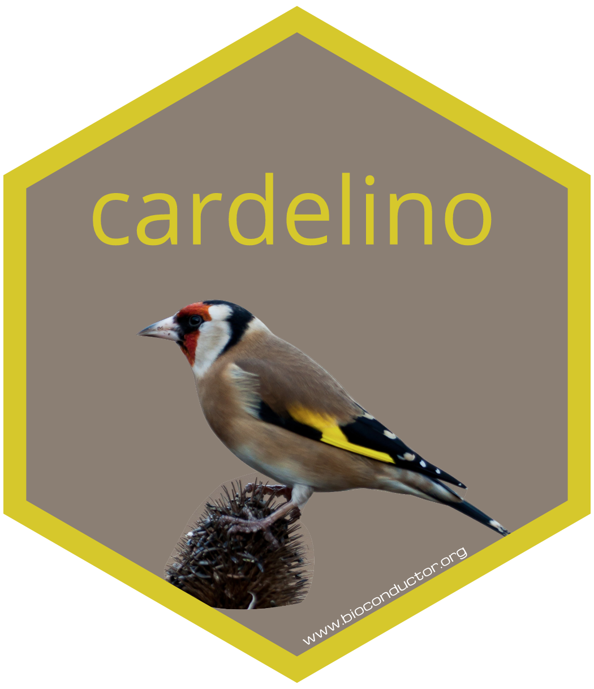

# cardelino: clone identification from single-cell data 

<!-- badges: start -->
[](https://github.com/single-cell-genetics/cardelino/actions)
<!-- badges: end -->

**cardelino** contains a Bayesian method to infer clonal structure for a 
population of cells using single-cell RNA-seq data (and possibly other data 
modalities). 

In it's main mode **cardelino** requires: 

* An imperfect clonal tree structure inferred using, for example [Canopy](https://cran.r-project.org/web/packages/Canopy/index.html), from bulk or single-cell DNA sequencing data (e.g. bulk whole exome sequencing data).

* Single-cell RNA sequencing data from which cell-specific somatic variants are called using, for example [cellsnp-lite](https://github.com/single-cell-genetics/cellsnp-lite).

## Installation

### Release version

You can install the release version of `cardelino` from BioConductor:

```r
if (!requireNamespace("BiocManager", quietly = TRUE))
    install.packages("BiocManager")

BiocManager::install("cardelino")
```

### Development version

The development version of `cardelino` can be installed using the 
[`remotes`](https://remotes.r-lib.org/) package thus:

```r
# install.packages("remotes")
remotes::install_github("single-cell-genetics/cardelino")
```

## Getting started

The best place to start are the vignettes. From inside an R session, load 
`cardelino` and then browse the vignettes:

```r
library(cardelino)
browseVignettes("cardelino")
```

## Notes on donor deconvolution

The donor demultiplex function, named Vireo, was previously supported in this 
R package, but now has been re-implemented in Python, which is more memory 
efficient and easier to run via a command line. We, therefore, highly recommend 
you switch to the Python version: https://vireoSNP.readthedocs.io. 

The vireo function is not supported from version >=0.5.0. If you want to use the
R functions, please use the version ==0.4.2 or lower. You can also find it in a
separate branch in this repository: [with_vireo branch](https://github.com/single-cell-genetics/cardelino/tree/with_vireo)
or use the [donor_id.R](https://github.com/single-cell-genetics/cardelino/blob/with_vireo/R/donor_id.R) 
file directly. However, using the Python implementation of Vireo is **strongly** recommended. 

## Code of Conduct

Please note that the cardelino project is released with a [Contributor Code of Conduct](http://bioconductor.org/about/code-of-conduct/).
By contributing to this project, you agree to abide by its terms.

## Citation

If you find cardelino helpful please consider citing: 

> McCarthy, D.J., Rostom, R., Huang, Y. et al. (2020)
> Cardelino: computational integration of somatic clonal substructure and single-cell transcriptomes.
> Nature Methods

## About the name

`cardelino` is almost an anagram of "clone ID R" and is almost the same as the 
Italian for "goldfinch", a common and attractive European bird, pictured below
and used in `cardelino`'s hex sticker. In the Western art canon, the goldfinch 
is considered a ["saviour" bird](https://en.wikipedia.org/wiki/European_goldfinch) 
and appears in notable paintings from the [Italian renaissance](https://en.wikipedia.org/wiki/Madonna_del_cardellino)
and the [Dutch Golden Age](https://en.wikipedia.org/wiki/The_Goldfinch_(painting)). 
Perhaps this package may prove a saviour for certain single-cell datasets!


**Acknowledgement:**
The `cardelino` image was produced by [Darren Bellerby](https://www.flickr.com/photos/world-birds/). It was obtained from
[Flickr](https://www.flickr.com/photos/world-birds/18740373165/in/photolist-uy2j3a-uxAdib-aLcHGB-9BjDvc-YkgQg7-QN9Tr1-BVjkHh-8oWiKC-WFkDcS-nhZzXt-Y4zM2h-zULNgX-7uZCFT-f5ghc4-Ugx9pj-UJ5tog-7v4rVy-7wsLpm-bru3Ha-JnmcUQ-frkUqa-bohcgU-KAB14-dieCGY-FJ6n6A-GHJ5UK-X2qjGh-8cAjtw-FshfBi-8cwZst-qEMHSX-dTtAUs-EtqKxo-oZdJB3-8cx1Tn-D1jHjU-PWzWY2-brtKfH-ch2tvW-qEFKTd-wVmxsG-oYZbhP-Aa5cBB-h6aQf6-9Bny23-ayfnFS-dgG2Kn-QUyKgf-bBc31B-cVik3)
and is reproduced here under a CC-BY-2.0
[licence](https://creativecommons.org/licenses/by/2.0/legalcode).
